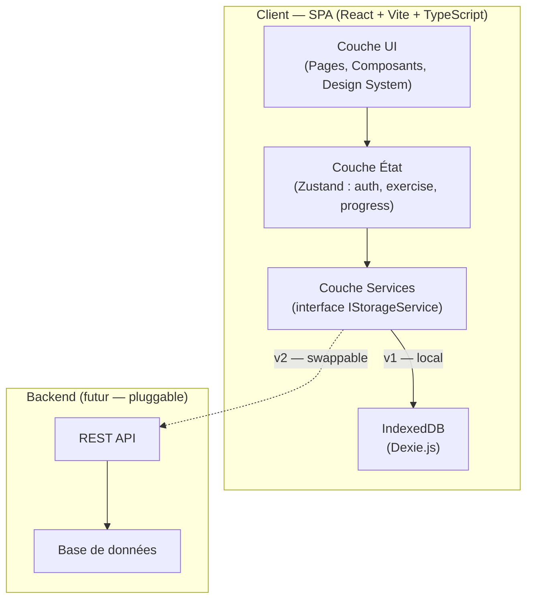
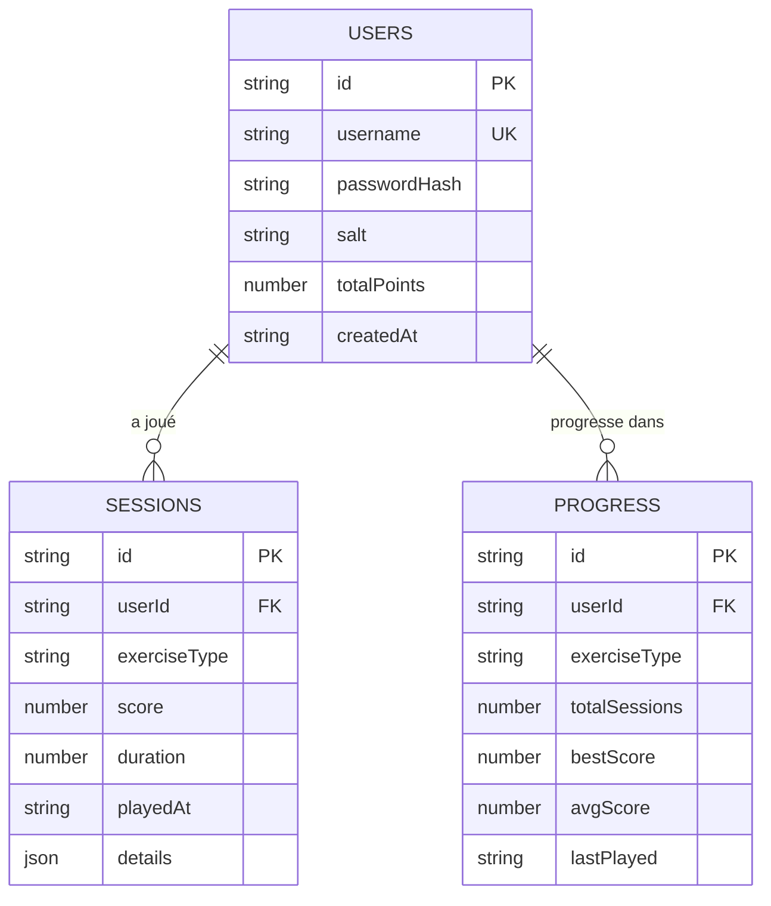
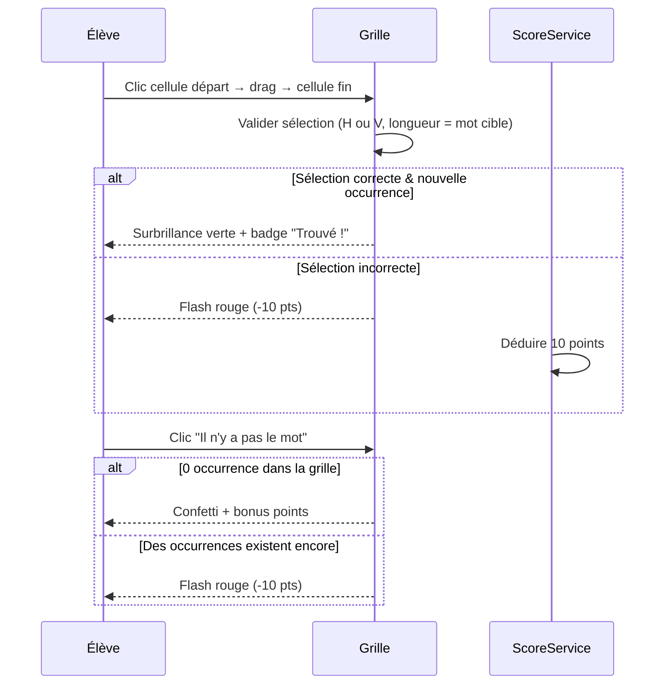
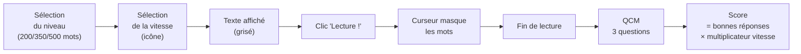

## Objectif

Construire une SPA React 18 + TypeScript responsive et installable (PWA), fonctionnant entièrement côté client (IndexedDB), avec une couche de service découplée prête à se connecter à un backend REST sans refactoring majeur.

---

## Architecture globale



---

## Stack technique

| Rôle | Librairie | Justification |
|---|---|---|
| Framework | React 18 + Vite + TypeScript | Performance, DX, typage fort |
| Style | Tailwind CSS v3 | Responsive rapide, utility-first |
| Routing | React Router v6 | SPA navigation + routes protégées |
| État global | Zustand | Léger, sans boilerplate |
| Persistance | Dexie.js (IndexedDB) | Structuré, requêtable, hors-ligne |
| Crypto | Web Crypto API (SubtleCrypto) | PBKDF2 natif navigateur, sans dépendance |
| Charts | Recharts | Composants React natifs, responsive |
| Animations | Framer Motion | Transitions fluides, feedback exercices |
| PWA | vite-plugin-pwa + Workbox | Cache, install prompt, offline |

---

## Structure de fichiers

```
src/
├── assets/                        # Icônes, illustrations, mascotte
├── components/
│   ├── ui/                        # Button, Card, Badge, Timer, Modal…
│   ├── layout/                    # AppShell, Header, BottomNav, Sidebar
│   └── exercises/
│       ├── WordSearch/            # Grid, SelectionOverlay, FoundBadge
│       ├── Intrus/                # WordList, WordChip
│       └── LectureRapide/        # TextMask, SpeedPicker, QCMBlock
├── pages/
│   ├── AuthPage.tsx               # Login + Register (tabs)
│   ├── HomePage.tsx               # Hub — sélection des exercices
│   ├── WordSearchPage.tsx
│   ├── IntrusPage.tsx
│   ├── LectureRapidePage.tsx
│   └── DashboardPage.tsx
├── services/
│   ├── storage/
│   │   ├── db.ts                  # Définition Dexie (tables + migrations)
│   │   ├── IStorageService.ts     # Interface abstraite (future API)
│   │   ├── userService.ts
│   │   └── scoreService.ts
│   └── crypto/
│       └── hashService.ts         # PBKDF2 via SubtleCrypto
├── store/
│   ├── authStore.ts
│   ├── exerciseStore.ts
│   └── progressStore.ts
├── data/
│   ├── wordSearch/                # sessions_*.json
│   ├── intrus/                    # level_1.json … level_5.json
│   └── lectureRapide/             # texts_niveau1.json … texts_niveau3.json
├── hooks/
│   ├── useTimer.ts
│   ├── useScore.ts
│   └── useSwipeNav.ts             # Navigation tactile mobile
├── types/
│   └── index.ts                   # Tous les types/interfaces TS
└── utils/
    ├── scoring.ts
    ├── gridParser.ts              # Validation des sélections grille
    └── textCursor.ts              # Logique d'animation de masquage
```

---

## Schéma de données — IndexedDB (Dexie.js)



### Interface découplée (future-proof)

```typescript
// src/services/storage/IStorageService.ts
interface IUserService {
  create(username: string, hash: string, salt: string): Promise<User>
  findByUsername(username: string): Promise<User | undefined>
  updatePoints(userId: string, delta: number): Promise<void>
}
interface IScoreService {
  save(session: Session): Promise<void>
  getHistory(userId: string, limit?: number): Promise<Session[]>
  getProgress(userId: string): Promise<Progress[]>
}
```
En v2, remplacer les implémentations Dexie par des appels `fetch()` vers une API REST — sans toucher aux composants React.

---

## Sécurité — Authentification

- **Algorithme** : PBKDF2-SHA256 via `SubtleCrypto.deriveKey()`
- **Sel** : 16 bytes aléatoires par utilisateur (`crypto.getRandomValues`)
- **Itérations** : 200 000 (conformité NIST 2024)
- **Stockage** : hash + sel en hex dans IndexedDB (jamais le mot de passe en clair)
- **Session** : `sessionStorage` (effacée à la fermeture de l'onglet) → rechargement via `authStore`

---

## Design System — "Apaisant mais jovial"

| Token | Valeur | Usage |
|---|---|---|
| `primary` | `#7C6FF7` | Violet lavande — boutons principaux, accents |
| `secondary` | `#FF7B54` | Corail chaud — CTA, badges scores |
| `accent` | `#FFD166` | Jaune doré — succès, étoiles |
| `bg` | `#F8F7FF` | Blanc teinté lavande — fond général |
| `success` | `#06D6A0` | Vert menthe — bonne réponse |
| `error` | `#EF476F` | Rose-rouge — erreur, pénalité |
| `text` | `#2D2D3A` | Anthracite doux — lisibilité maximale |

- **Police** : `Nunito` (Google Fonts) — ronde, amicale, excellente lisibilité 11-15 ans
- **Taille de base** : 16px mobile, 18px desktop
- **Coins** : `rounded-2xl` — aucune arête vive
- **Responsive** : bottom nav (mobile) → sidebar (tablette/desktop)

---

## Phases de développement

### Phase 1 — Scaffolding & configuration

**Cibles** : `vite.config.ts`, `tailwind.config.ts`, `tsconfig.json`, `index.html`

- `npm create vite@latest` (React + TypeScript)
- Installation : Tailwind CSS, React Router v6, Zustand, Dexie.js, Recharts, Framer Motion, vite-plugin-pwa
- Configuration ESLint + Prettier
- Import Google Font Nunito dans `index.html`
- Définition des tokens Tailwind (couleurs, police) dans `tailwind.config.ts`
- Alias `@/` → `src/` dans Vite

**Vérification** : `npm run dev` → page blanche sans erreur TS/ESLint

---

### Phase 2 — Couche données & Sécurité

**Cibles** : `src/services/`, `src/types/index.ts`

- Définir tous les types TypeScript (`User`, `Session`, `Progress`, `Grid`, `IntrusList`, `LectureText`, `QCMQuestion`)
- `db.ts` : créer les 3 tables Dexie + schéma de migration v1
- `hashService.ts` : fonctions `hashPassword(plain, salt)` et `verifyPassword(plain, hash, salt)` via SubtleCrypto
- `userService.ts` : `createUser`, `findByUsername`, `updatePoints`
- `scoreService.ts` : `saveSession`, `getHistory`, `getProgress`

**Vérification** : tests unitaires dans la console navigateur (création user, hash, vérification)

---

### Phase 3 — Authentification

**Cibles** : `src/pages/AuthPage.tsx`, `src/store/authStore.ts`, `src/components/layout/ProtectedRoute.tsx`

- `authStore` (Zustand) : `currentUser`, `login()`, `logout()`, `register()`
- `AuthPage` : deux onglets (Connexion / Inscription) avec design jovial
  - Validation username : 3-20 caractères, alphanumérique + tirets
  - Indicateur de force du mot de passe
  - Messages d'erreur en français (username pris, mauvais mot de passe…)
- `ProtectedRoute` : redirige vers `/` si non connecté
- Persistence de session : re-hydratation depuis `sessionStorage` au montage

**Vérification** : inscription, connexion, déconnexion ; hash visible dans IndexedDB (DevTools)

---

### Phase 4 — Shell & navigation

**Cibles** : `src/components/layout/`, `src/pages/HomePage.tsx`

- `AppShell` : header (logo + points totaux + avatar), zone contenu, nav
- Navigation responsive :
  - Mobile (< 768px) : bottom nav avec icônes (Accueil, Exercices, Tableau de bord)
  - Tablette/Desktop : sidebar gauche collapsible
- `HomePage` : hub central avec 3 cards exercices (illustration, titre, meilleur score)
- Transitions de page avec Framer Motion (`AnimatePresence`)

**Vérification** : navigation fluide sur mobile (DevTools), protection des routes

---

### Phase 5 — Exercice 1 : Recherche de mots

**Cibles** : `src/components/exercises/WordSearch/`, `src/pages/WordSearchPage.tsx`

**Mécanique de la grille :**


**Composants :**
- `WordSearchGrid` : rendu des cellules, gestion pointer events (souris + tactile)
- `SelectionOverlay` : surlignage dynamique pendant le drag
- `SessionProgress` : barre de progression (grille X/6) + timer circulaire
- `ResultScreen` : score de la grille, transition vers la suivante

**Session — 6 grilles, difficulté croissante :**

| Grille | Taille | Occurrences possibles | Chrono |
|---|---|---|---|
| 1 | 8×8 | 1 | 120s |
| 2 | 9×9 | 1-2 | 105s |
| 3 | 10×10 | 0-2 | 90s |
| 4 | 11×11 | 0-3 | 80s |
| 5 | 12×12 | 0-4 | 70s |
| 6 | 14×14 | 0-5 | 60s |

**Scoring Exercice 1 :**
- Base : 100 pts/occurrence trouvée
- Bonus temps : `Math.floor(secondesRestantes × 0.5)` pts
- Pénalité : -10 pts par erreur (sélection incorrecte ou "pas le mot" incorrect)

**Vérification** : jouer une session complète, vérifier score final persisté en IndexedDB

---

### Phase 6 — Exercice 2 : L'Intrus

**Cibles** : `src/components/exercises/Intrus/`, `src/pages/IntrusPage.tsx`

**5 niveaux de difficulté :**

| Niveau | Nb mots | Type de difficulté |
|---|---|---|
| 1 | 8 | Catégories sémantiques claires (animaux, fruits…) |
| 2 | 10 | Même catégorie, intrus de catégorie proche |
| 3 | 12 | Même champ lexical, intrus de genre/nombre différent |
| 4 | 14 | Quasi-homophones ou quasi-homophones visuels |
| 5 | 16 | Différence d'une lettre / accent, très subtil |

**Composants :**
- `IntrusWordChip` : chip cliquable avec animation Framer Motion
- `IntrusList` : grille responsive de chips, mots mélangés aléatoirement
- Feedback immédiat : vert si correct, rouge si incorrect + mot unique révélé
- Timer par liste (ex. : Niv1=30s, Niv5=15s)

**Scoring Exercice 2 :**
- 50 pts par bonne réponse + bonus temps `secondesRestantes × 2`
- Mauvaise réponse : 0 pts pour cette liste (pas de pénalité — accessibilité enfants)

**Session** : 10 listes (piochées aléatoirement dans le pool JSON du niveau choisi)

**Vérification** : tester les 5 niveaux, vérifier le mélange aléatoire des mots

---

### Phase 7 — Exercice 3 : Lecture rapide

**Cibles** : `src/components/exercises/LectureRapide/`, `src/pages/LectureRapidePage.tsx`

**Flux de l'exercice :**


**Vitesses et multiplicateurs :**

| Icône | Label | MPM (mots/min) | Multiplicateur |
|---|---|---|---|
| Tortue | Tout doux | 100 | ×1 |
| Marcheur | À mon rythme | 180 | ×1.5 |
| Vélo | Je pédale | 280 | ×2 |
| Voiture | Vite vite ! | 420 | ×2.5 |
| Fusée | Mode génie | 600 | ×3 |

**Mécanisme de masquage (`textCursor.ts`) :**
- Le texte est affiché mot par mot dans des `<span>` numérotés
- Un `requestAnimationFrame` loop calcule l'index courant selon `MPM` et le temps écoulé
- Les mots "passés" reçoivent la classe `opacity-0 transition-opacity`
- Pas d'arret possible (encourage la concentration)

**Composants :**
- `SpeedPicker` : sélecteur d'icônes animées avec label
- `TextMask` : rendu du texte avec gestion des spans et de l'animation
- `QCMBlock` : 3 questions × 4 options radio, bouton Valider
- `ResultScreen` : score détaillé (bonnes réponses + multiplicateur appliqué)

**Vérification** : tester aux 5 vitesses sur mobile et desktop, vérifier le score QCM × multiplicateur

---

### Phase 8 — Tableau de bord élève

**Cibles** : `src/pages/DashboardPage.tsx`

**Contenu :**
- **Carte récapitulative** : total de points, sessions jouées, série en cours (streak quotidien)
- **Graphique 1** (Recharts `LineChart`) : évolution des points sur les 10 dernières sessions
- **Graphique 2** (Recharts `BarChart`) : score moyen par type d'exercice
- **Historique** : liste des 20 dernières sessions (date, exercice, score, durée)
- **Badges** : jalons de progression (1ère session, 100 pts, 500 pts, série de 7 jours…)

**Vérification** : données correctement agrégées depuis IndexedDB, graphiques responsive

---

### Phase 9 — Population du contenu JSON

**Cibles** : `src/data/`

**Exercice 1 — Word Search :**
- 3 sessions de 6 grilles chacune (rotation automatique)
- Grilles pré-générées manuellement ou via un script Python dédié
- Format : `{ id, difficulty, targetWord, grid: string[][], occurrences: {row, col, direction}[], timeLimit }`

**Exercice 2 — L'Intrus :**
- 5 fichiers JSON (1 par niveau)
- 30 listes par niveau minimum (10 tirées aléatoirement par session)
- Format : `{ id, uniqueWord, repeatedWord, count: number }`

**Exercice 3 — Lecture rapide :**
- Niveau 1 : 5 textes de ~200 mots (fables, récits courts)
- Niveau 2 : 5 textes de ~350 mots (nouvelles, articles jeunesse)
- Niveau 3 : 5 textes de ~500 mots (extraits littéraires, contes)
- Chaque texte : `{ id, title, genre, level, text: string, qcm: Question[] }`
- Chaque `Question` : `{ question, options: string[4], correctIndex: number }`

---

### Phase 10 — PWA & finalisation

**Cibles** : `vite.config.ts`, `public/manifest.webmanifest`, `src/sw.ts`

- `vite-plugin-pwa` : génération automatique du Service Worker via Workbox
- Stratégie de cache :
  - `CacheFirst` : assets statiques (JS, CSS, images, JSON de données)
  - `NetworkFirst` : pages HTML (pour les mises à jour futures)
- `manifest.webmanifest` : nom "Les Ptits Génies", icônes 192px + 512px, `theme_color: #7C6FF7`, `background_color: #F8F7FF`, `display: standalone`
- Prompt d'installation discret sur la `HomePage`
- Test hors-ligne : couper le réseau dans DevTools → l'app doit rester fonctionnelle

---

## Traçabilité Étape → Cibles → Vérification

| Phase | Fichiers principaux | Critère de validation |
|---|---|---|
| 1 — Scaffold | `vite.config.ts`, `tailwind.config.ts` | `npm run dev` sans erreur |
| 2 — Données | `src/services/`, `src/types/` | Hash PBKDF2 fonctionnel en console |
| 3 — Auth | `AuthPage.tsx`, `authStore.ts` | Cycle complet inscription/connexion/déconnexion |
| 4 — Shell | `AppShell`, `HomePage` | Navigation responsive mobile+desktop |
| 5 — Ex.1 | `WordSearchPage`, `WordSearchGrid` | Session 6 grilles, score persisté |
| 6 — Ex.2 | `IntrusPage`, `IntrusList` | 5 niveaux jouables, pool aléatoire |
| 7 — Ex.3 | `LectureRapidePage`, `TextMask` | Animation fluide + QCM + score multiplié |
| 8 — Dashboard | `DashboardPage` | Graphiques correctement calculés |
| 9 — Contenu | `src/data/**/*.json` | Tous les exercices jouables avec vrai contenu |
| 10 — PWA | `manifest`, Service Worker | App installable + fonctionnelle hors-ligne |
